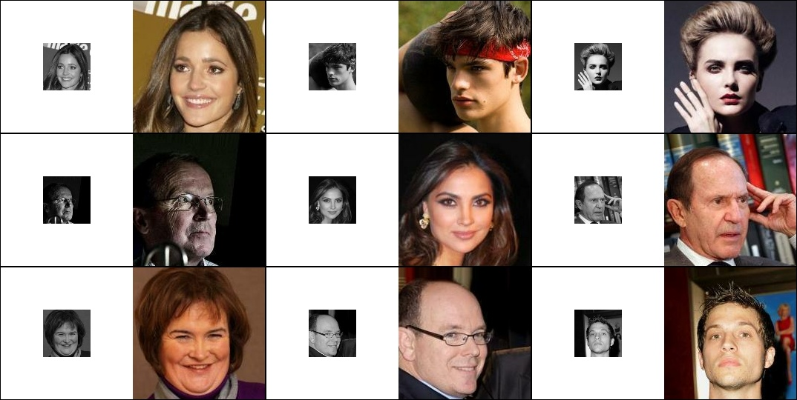

# Frankenstein Network (FranNet)

FranNet is a neural network architecture that combines a CNN encoder with a NeRF-like decoder to perform upscaling, denoising, and colorization of input images. The purpose of this project is to explore the capabilities and limitations of this approach and implement it as a proof of concept. A bit more detailed description of the network can be found in the [overview](docs/overview.md).

The choice of upscaling and colorization tasks was made because they are interesting and visually appealing, and they do not require a significant amount of resources. Additionally, these tasks lend themselves well to the application of NeRF (Neural Radiance Fields). While NeRF is typically used for different purposes, I was intrigued by its ability to generate images from individual rays/points, which is ideal for upscaling.

Due to extremely limited resources, achieving photorealism is not a feasible goal. The project is primarily exploratory in nature and currently lacks practical applicability.

## Current setup and dataset description

At present, the project utilizes the [CelebA dataset](https://paperswithcode.com/dataset/celeba), which consists of facial images of individuals at a resolution of 178×218 pixels. These images are cropped to a size of 178×178 pixels, then downscaled to 64×64 pixels and converted to grayscale, which serves as the input for FranNet. The color version of the 178×178 image is used as an example of the correct inverse transformation.

Unfortunately, due to the time-consuming nature of the complete validation process, a small portion of the test dataset is used for validation. This measure is necessary to accelerate the training process, despite its potential implications as a suboptimal practice.

Furthermore, the neural network itself has fewer than 600,000 parameters. On one hand, this significantly reduces the overall quality. On the other hand, I consider this approach more appropriate than pursuing higher quality at the expense of increasing the network's size.

## Baseline oracles

The baseline for upscaling and colorization is a naive approach used as a reference point for comparison. Upscaling simply applies a basic upscaling method, such as bilinear or bicubic interpolation, to the input image. Colorization is performed either by using the color version of the image as a reference or by simply returning the grayscale image as the result.

Using the color version of the image as a reference for the oracle would provide an unfair advantage, as it would essentially be using the ground truth information to perform the task. Therefore, the oracle is evaluated with and without using the color image as a reference to assess its performance objectively. As can be seen from the table, even when using the color image as a reference, the results are not perfect due to information loss during resizing.

<table class="myTable">
  <tr>
    <th colspan="5">Entire test dataset</th>
  </tr>
  <tr>
    <th></th>
    <th colspan="2">with color reference</th>
    <th colspan="2">without color reference</th>
  </tr>
  <tr>
    <th>Method</th>
    <th>RGB MSE</th>
    <th>Grayscale MSE</th>
    <th>RGB MSE</th>
    <th>Grayscale MSE</th>
  </tr>
  <tr>
    <td>nearest</td>
    <td>0.00302</td>  <td>0.00297</td>
    <td>0.01256</td>  <td>0.00296</td>
  </tr>
  <tr class='used'>
    <td>bilinear</td>
    <td>0.00149</td>  <td>0.00148</td>
    <td>0.01107</td>  <td>0.00148</td>
  </tr>
  <tr>
    <td>bicubic</td>
    <td>0.00141</td>  <td>0.00140</td>
    <td><b>0.01100</b></td>  <td>0.00140</td>
  </tr>
  <tr>
    <td>area</td>
    <td>0.00174</td>  <td>0.00171</td>
    <td>0.01131</td>  <td>0.00171</td>
  </tr>

  <tr>
    <th colspan="5">Used for validation subset (512 images)</th>
  </tr>
  <tr>
    <th></th>
    <th colspan="2">with color reference</th>
    <th colspan="2">without color reference</th>
  </tr>
  <tr>
    <th>Method</th>
    <th>RGB MSE</th>
    <th>Grayscale MSE</th>
    <th>RGB MSE</th>
    <th>Grayscale MSE</th>
  </tr>
  <tr>
    <td>nearest</td>
    <td>0.00299</td>  <td>0.00293</td>
    <td>0.01337</td>  <td>0.00293</td>
  </tr>
  <tr class='used'>
    <td>bilinear</td>
    <td>0.00148</td>  <td>0.00146</td>
    <td>0.01190</td>  <td>0.00146</td>
  </tr>
  <tr>
    <td>bicubic</td>
    <td><b>0.00139</b></td>  <td><b>0.00138</b></td>
    <td>0.01182</td>  <td><b>0.00138</b></td>
  </tr>
  <tr>
    <td>area</td>
    <td>0.00173</td>  <td>0.00170</td>
    <td>0.01213</td>  <td>0.00170</td>
  </tr>
</table>

(data was collected via `scripts/test-oracle.py`)

In brief, the RGB MSE value of `0.01100` can be considered the primary baseline since it represents the ability to restore color from grayscale images. Achieving a value close to `0.003` is considered close to ideal, indicating high accuracy in restoring the color channels.

Monitoring the Grayscale MSE is also important. The value of `0.00297` for this metric is crucial. If this metric is higher, it means that the network fails to perform the naive upscale of grayscale images accurately.

Both the RGB MSE and Grayscale MSE metrics provide valuable insights into the performance of the network.

## Experiments

While working on the project, I encountered various aspects, including the ease of conducting experiments. All parts of the neural network are implemented in a highly flexible manner and configured through JSON. Integration with [Weights&Biases](https://wandb.ai/green_wizard/FranNet) is also implemented.

Read more about the experiments in the [experiments.md](docs/experiments.md).