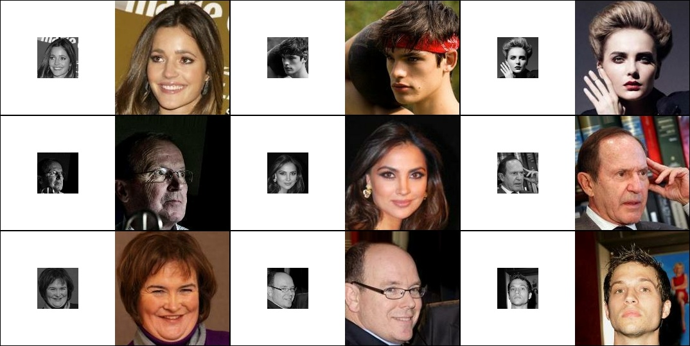

# Current setup and dataset description

At present, the project utilizes the [CelebA dataset](https://paperswithcode.com/dataset/celeba), which consists of facial images of individuals at a resolution of 178×218 pixels. These images are cropped to a size of 178×178 pixels, then downscaled to 64×64 pixels and converted to grayscale, which serves as the input for FranNet. The color version of the 178×178 image is used as an example of the correct inverse transformation.

Unfortunately, due to the time-consuming nature of the complete validation process, a small portion of the test dataset is used for validation. This measure is necessary to accelerate the training process, despite its potential implications as a suboptimal practice.

Furthermore, the neural network itself has fewer than 600,000 parameters. On one hand, this significantly reduces the overall quality. On the other hand, I consider this approach more appropriate than pursuing higher quality at the expense of increasing the network's size.
