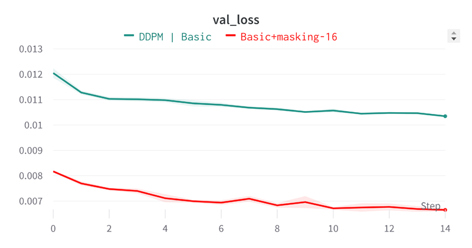
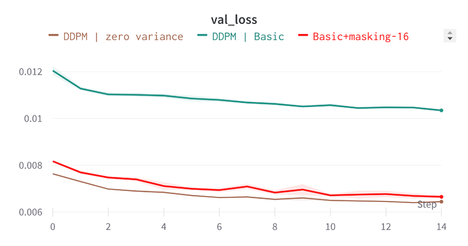
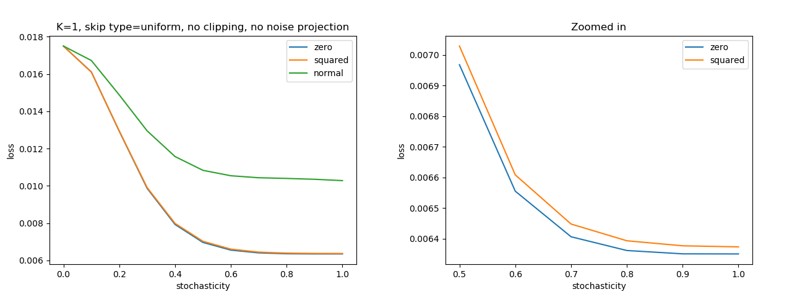
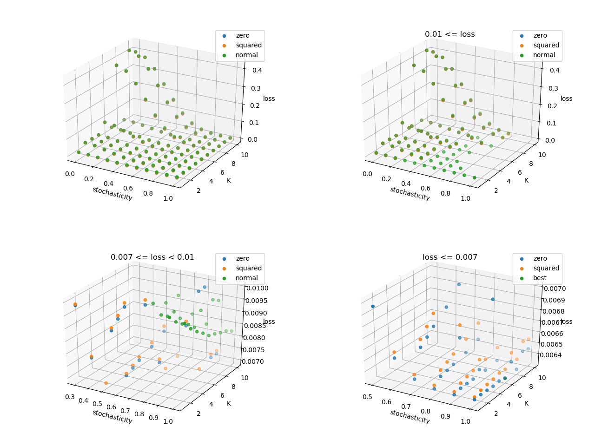
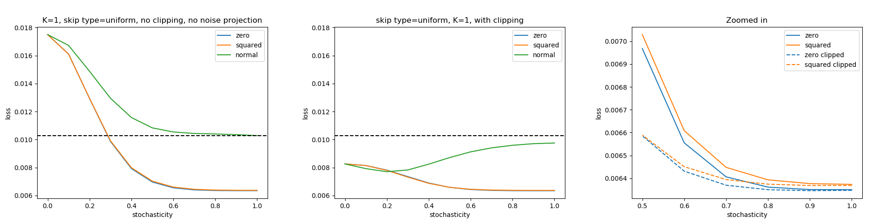
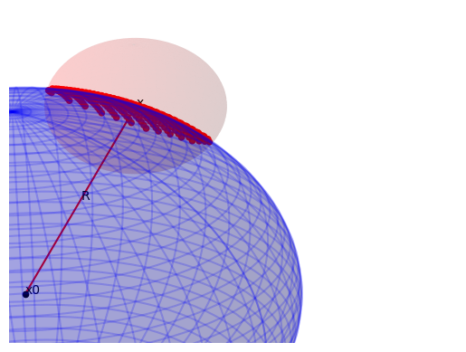
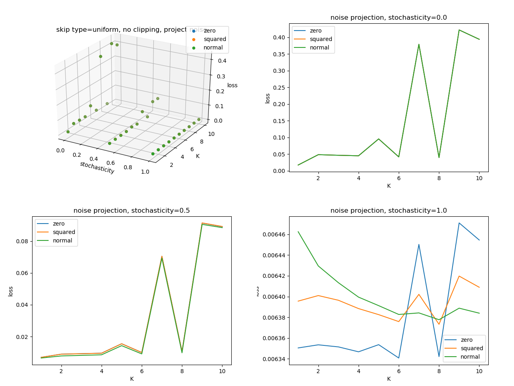
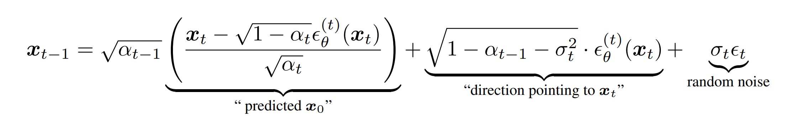
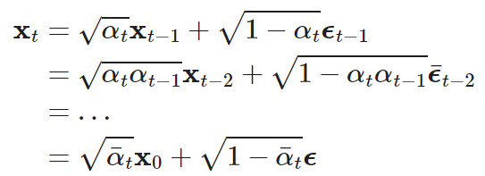

# Restoration via diffusion process

I have opted to use the cosine beta schedule for the diffusion process, as it is widely regarded as one of the most popular and advanced approaches. The diffusion process I employed is discrete, comprising a total of 100 steps. Let's examine the comparison between the loss values obtained from training the `single-pass restorator` and the `diffusion restorator`:

It is clear that the `diffusion restorator` performs significantly worse compared to the `single-pass restorator` and barely outperforms the baseline. Despite attempting to enhance the results by increasing the diffusion steps to 1000, no positive outcomes were achieved. Regrettably, this adjustment considerably prolonged the training process as validating on 1000 steps became excessively time-consuming.

Based on these findings, one could initially conclude that using the diffusion process for restoration purposes is not viable. However, motivated to understand the reasons behind this behavior and strive for improved results, I embarked on further exploration. Surprisingly, one of the primary factors identified was the introduced noise during the reverse diffusion process.

While noise is an inherent part of the diffusion process, it's specific characteristics have a significant impact on the outcome of the sampling process. Based on recent investigations and the definition of the diffusion process itself, it appears that the noise is not critically essential and can even be completely eliminated. To put it simply, there is a maximum level of noise added at each step, specified by `sigma`, and it should not exceed the bounds of Gaussian noise.

Currently, it is unclear whether this is a unique characteristic of the specific task at hand or if it is applicable to other tasks as well. However, I have discovered that the best results are achieved by adding noise with a variance of `sigma ^ 2`, rather than just using `sigma`. On the other hand, if the noise is entirely excluded by setting sigma to zero, the results do improve to some extent, but the neural network loses its robustness to errors.

**Please note that the `diffusion restorator` model was not retrained, and the results were achieved by adjusting the sampling parameters and/or algorithm.**

As you can observe, when we set `sigma = 0.0`, the `diffusion restorator` has now surpassed the `single-pass restorator` in terms of loss. However, the obtained results are still far from ideal. As we discovered later, similar results are obtained when using noise with a variance of `sigma ^ 2`, which significantly differs from the original implementation but aligns with the assumptions made earlier.

## DDIM sampler parameters

The DDIM sampler has the following parameters:

- `stochasticity`: It determines the degree of stochasticity by controlling the amount of noise added during the diffusion process. The value ranges from `0.0` to `1.0`.

- `clipping`: This parameter sets the limits on the values that can be generated during the diffusion process. It can be set to `None` or a dictionary with `min` and `max` values, such as `{min: -1.0, max: 1.0}`, in our case.

- `steps skipping`: This algorithm allows skipping certain steps during the diffusion process, which can speed up the overall process.

- `noise stddev`: It determines how noise is considered during the diffusion process. It can take one of the following options: `['normal' or 'correct', 'zero', 'squared']`.

If `stochasticity` is set to `1.0` and `K = 1` (does not skip any steps), the DDIM sampler behaves like the DDPM sampler (refer to [`test_DDPM_eq_DDIM_sample`](../tests/test_diffusion_samplers.py)).

As we can see, both `stochasticity` and `noise stddev` have a significant impact on the results. If we completely eliminate stochasticity, the quality of the results decreases significantly. The best results are obtained when we allow the addition of noise, but there is no actually added noise. I propose that the reverse diffusion process fails to completely eliminate the added noise at each step, leading to the accumulation of errors.

To simplify the analysis, the data is presented in the form of multiple slices. It is evident that most parameter combinations yield unsatisfactory results. The standard magnitude of added noise, characterized by `noise stddev = normal`, only produces competitive outcomes when the value of `K` is sufficiently large. This observation can be attributed to the accumulation of errors during the reverse diffusion process. With larger values of `K`, the reverse diffusion process involves fewer steps, reducing the probability of encountering significant amounts of noise.

The most favorable results are achieved when using `stochasticity=1.0, K=6, noise stddev=zero`. However, determining the statistical significance of these specific parameter settings proves challenging.

Applying clipping to limit the range of values to `[-1, 1]` can enhance the outcomes, but it is not a definitive solution. Furthermore, this approach contradicts the very concept of the diffusion process and serves more as a temporary workaround.

## Noise projection

After analyzing and conducting some other experiments, a hypothesis emerged that the added noise should lie on the surface of a sphere, where the radius and position of the sphere are linked to the diffusion process. During the DDIM sampling process, we find the estimated `x0`, so we can calculate the distance to it and project the noisy value onto this sphere. I will illustrate this in more detail below.

In reality, we are dealing with a much smaller amount of added noise, than illustrated in the figure above. Nevertheless, this added noise can either push the current value towards `x0` or push it beyond the sphere. The size of the sphere depends on the current step of diffusion, and there may be situations where the diffusion process cannot bring the value back inside the sphere. In such cases, we encounter a situation where the value lies outside the sphere, leading to an error.

However, if we project the new values back onto the sphere, we can avoid this problem. Of course, we lose variability in the direction towards `x0`, but it is better than reducing variability in all directions, as is the case with `noise stddev=zero` or `noise stddev=squared`.

There is a clear correlation between the quality of the results and the parameter `stochasticity`. Additionally, the choice of `K` and, in general, the selection of sampling steps play a significant role overall. Some values of `K` result in a significant decrease in quality. However, I did not investigate this aspect in detail in this study.

As we can see, when `stochasticity=1.0`, the results are very stable and of high quality. However, when `stochasticity=0.0`, the results are significantly worse. This observation holds true for all variations of `noise stddev`, indicating that the noise itself is not critically important. Let's take a detailed look at the formula for calculating the next diffusion step in the DDIM sampler (Eq. 12 in the [paper](https://arxiv.org/abs/2010.02502)):

We eliminate a `random noise` part by setting `noise stddev=zero`. The remaining part of the formula is very similar to the diffusion forward process:

If we revisit the illustration with spheres, the formulas mentioned above can be interpreted as shifting the center of the smaller sphere closer to the center of the larger sphere. This adjustment significantly reduces the probability of exceeding the boundaries of the larger sphere. Consequently, we achieve more stable results when `stochasticity=1.0`. Additionally, by increasing the value of `K` (in the formulas above, `t - 1` is actually `t - K`), we further shift the center of the smaller sphere towards the center of the larger sphere, leading to further improvements in the quality of the results.

The most likely cause of the observed effects is the overestimation of predicted values. Although the neural network predicts the general direction of the vector `noise -> x0` fairly well, it fails to accurately estimate its magnitude. As the prediction accuracy improves, the effectiveness of the `noise projection` may decrease, but further investigation is required to confirm this.

## Rounding Errors and Numerical Instability

I have made numerous attempts to address the issues of rounding errors and numerical instability, but my efforts have either been unsuccessful or have resulted in only minor improvements. I believe that this is a crucial topic to address because the computational errors I have observed in the calculations themselves are on the order of `1e-5`, which is highly significant.

Most implementations of diffusion models rely on `float32` data type and employ simplistic calculation methods, leaving them susceptible to these problems. While the impact of these errors may be relatively small for smaller neural networks, I strongly recommend considering the utilization of `float64` in the scheduler for diffusion models. This adjustment would provide increased precision and potentially alleviate the issues associated with rounding errors and numerical instability.

Furthermore, it is worth delving into alternative approaches, specifically considering the incorporation of logarithmic number representation to obtain a higher degree of precision.