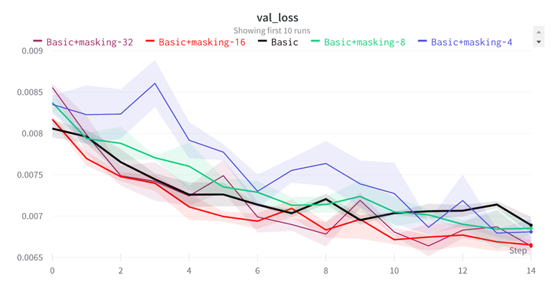
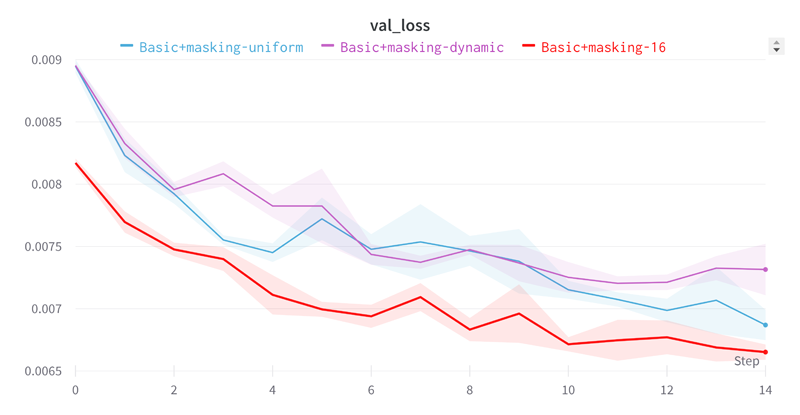

# Comparison study of training of single-pass restorator with masking

In this comparison study, we explore the effectiveness of incorporating masking techniques with different grid sizes (32x32, 16x16, 8x8, and 4x4) during the training process.

Among the tested grid sizes, the 16x16 grid masking technique yielded the best results in terms of loss, convergence speed, and stability. The 16x16 grid size closely matches the receptive field size of the network, allowing the restorator to effectively capture and restore missing details within this range.

It is worth noting that alternative approaches utilizing random selection of grid sizes yielded worse results.

