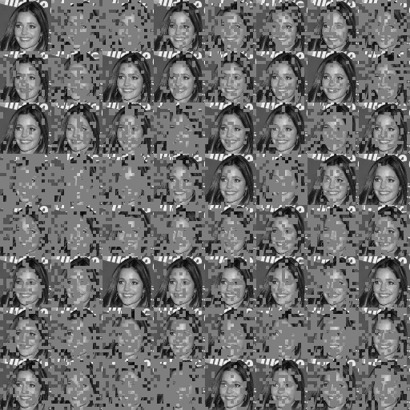

# Masking augmentation during the training process

Currently, only grid masking strategy is implemented as an augmentation during the training process. For each sample in a batch, a grid of a specified size is created. The number of cells to be masked are selected randomly from the specified range. Then corresponding number of random cells are selected for masking. The resulting binary mask is resized to match the size of the input image and multiplied element-wise with the image. The resulting masked image is then fed into the network.

For example, if the input image size is `64x64` and the grid size is `16x16`, each cell in the grid will have a size of `4x4` pixels. Here is a table with some examples of grid sizes and their corresponding cell sizes, assuming the input image size is `64x64`.

Grid Size | Cell Size
--------- | ---------
 64x64    | 1x1
 32x32    | 2x2
 16x16    | 4x4
 8x8      | 8x8
 4x4      | 16x16

This grid masking augmentation helps introduce local perturbations in the input images, forcing the network to learn more robust features and enhancing its ability to generalize.

Examples of grid masking augmentation applied to the same input image:

It's worth noting that the resizing operation allows for the use of grids of arbitrary sizes, not just powers of two. Interesting patterns can emerge when prime numbers are used for the grid size. In such cases, cells will have different sizes, which can significantly enhance the network's robustness.