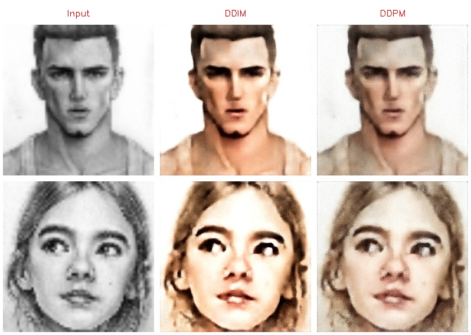
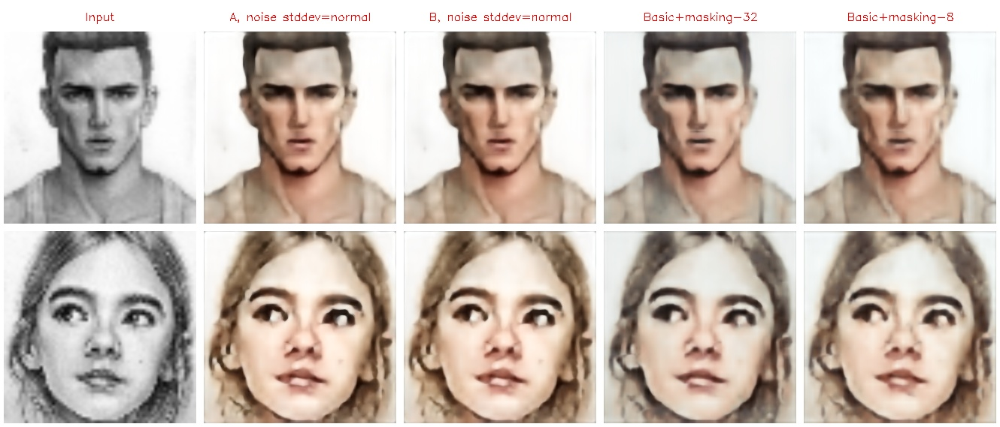
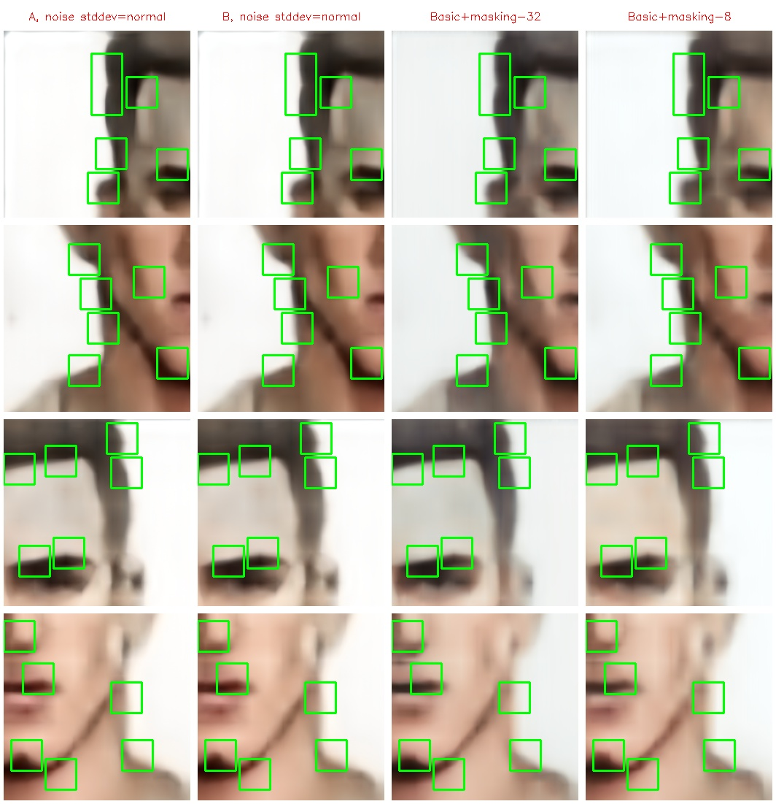
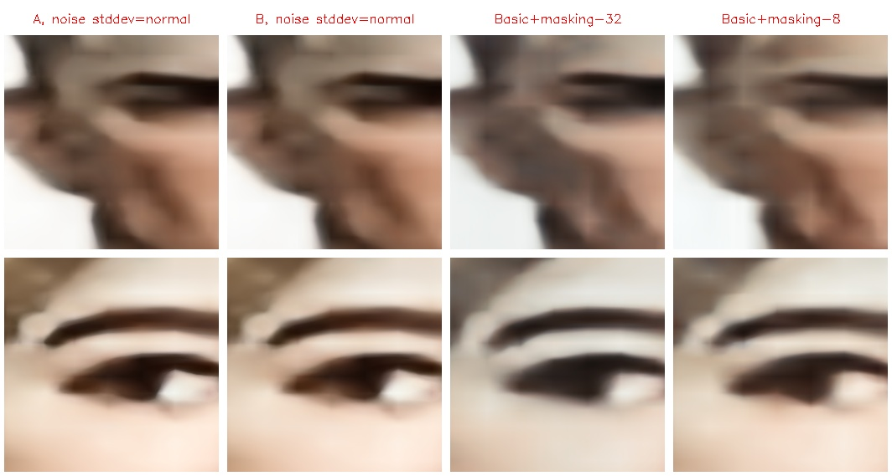

# Diffusion restorator visualization

Before proceeding, it is recommended that you read [this note on visualizations](visualize-note.md) and [this note on the diffusion restorator](diffusion-restorator.md) to better understand the following.

All visualizations for the `diffusion restorator` have been generated using the most recent model weights from [this run](https://wandb.ai/green_wizard/FranNet/runs/2ambitvn).

## Comparison of the DDPM and DDIM setups

Just out of curiosity, let's examine and compare the samplers used in the original DDPM and DDIM models. In terms of DDIM terminology, the original DDPM sampler can be described as follows: `K=1, noise projection = false, stochasticity = 1.0, noise stddev = normal`. On the other hand, the original DDIM sampler settings are: `K=1, noise projection = false, stochasticity = 0.0, noise stddev = normal`.

In essence, the primary distinction between the original settings of DDPM and DDIM lies in the `stochasticity` parameter. Now, let's delve into how this parameter influences the outcomes.

Both setups have captured the overall structure of the images well, but their results contain too much noise. The images generated by DDIM appear cleaner, but still of poor quality. As I mentioned in [this note](diffusion-restorator.md), the model is not sufficiently well-trained, resulting in unsatisfactory outputs. Of course, one could endlessly increase the number of training epochs and the model's size, but let's leave that to the other researchers.

## Restoration of the entire image by the `diffusion restorator` with different setups

The following setups were used for visualization:

- Basic+masking-32 (loss: 0.00639, `single-pass restorator`)
- Basic+masking-8 (loss: 0.00638, `single-pass restorator`)
- Basic `diffusion restorator`
  - `K=1, noise projection = true, stochasticity = 1.0, noise stddev = normal` (further `A`) (loss: 0.00646)
  - `K=8, noise projection = true, stochasticity = 1.0, noise stddev = normal` (further `B`) (loss: 0.00637)

As you can notice, both setups of the `diffusion restorator` now utilize `noise projection = true`. This significantly improves the quality of the output. Additionally, setup `B` operates 8 times faster than `A` while achieving a better loss. Many other setups with similar parameters also exhibit similar loss values and generate nearly identical results. Therefore, only setups `A` and `B` will be used for visualization.

The differences may be minor, yet observable. Visually, the images restored using the `diffusion restorator` appear slightly crisper and more refined. Additionally, the colors exhibit a greater naturalness and smoothness. It's an intriguing outcome, considering that the `single-pass restorator` required the incorporation of masking augmentation during the training process to capture the interplay between different regions. In contrast, the `diffusion restorator` was trained without any augmentations.

To highlight the differences, I created a [script](../scripts/find-roi.py) that searches for regions with the highest statistical variances between images. Here are the results:

Unfortunately, the differences between setups `A` and `B` are hardly noticeable. While this is not ideal for visualization purposes, it is actually beneficial in terms of performance. Setup `B` operates eight times faster while maintaining identical restoration quality.

## Restoration of a local region of the image

(To understand the concept of local region restoration, please refer to the following [note](visualize-note.md).)

Differences are quite significant and don't require additional comments. Setups `A` and `B` show almost identical results, but when considering the original images (sized 1024x1024), it can be noticed that setup `B` renders more blurred images. This is because setup `B` uses a lower number of diffusion steps compared to setup `A`, and it doesn't have enough time to restore the details.
