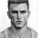
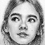

# On visualizations and comparing models

Visualizations were generated for the following images:

(Full size images can be found in the [img/testing](img/testing) folder.)

These images are clearly out-of-distribution but maintain the same semantic meaning as the training data. Additionally, it is important for the images to contain textures; otherwise, models may struggle to reconstruct colors accurately. Each image is initially downscaled to 64x64 and converted to grayscale. Then, a grid of points of the desired size (1024x1024 in this case, which is 16 times larger than the input image) is generated. The model predicts colors for each point independently, without considering the context of other points. This means that the model cannot take into account the image's overall context. The resulting colors of the points are assembled into an image of the desired size.

Below, you can see the original images used as inputs for the models. They are of the same size and in grayscale, allowing you to comprehend the challenges encountered by the models when attempting to generate colorized and upscaled images.

In all the visualizations, the target size is set at 1024x1024. To facilitate easier viewing, the displayed images have been reduced to 256x256 for space-saving purposes. This reduction does not significantly distort the results and enables a clear comparison between the models.

## Restoring local regions with FrankNet

In order to restore images, FrankNet operates on individual points, making it flexible in choosing the points for reconstruction. While we have the freedom to choose the points, a simplified method has been implemented to restore arbitrary rectangular regions. However, the potential exists to generate regions of any shape and resolution.

When we mention "local regions" in the context of visualizations, we specifically refer to an area within the image with coordinates ranging from `(0.2, 0.2)` to `(0.4, 0.6)` (input image size is `64x64`, so the coordinates are referring to a `12x24` region within the image). This rectangular region represents our focus, and the objective is to generate a high-quality `1024x1024` image specifically for this region.

It's important to keep in mind that the restoration process goes beyond mere resizing of the region. FrankNet utilizes a neural network that generates all the necessary pixels and subpixels to reconstruct the local region.