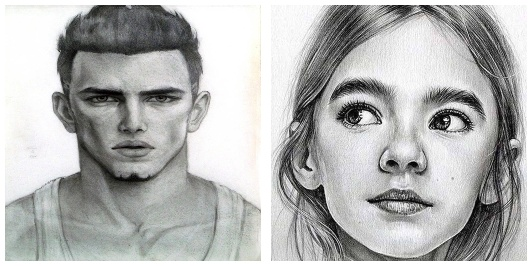
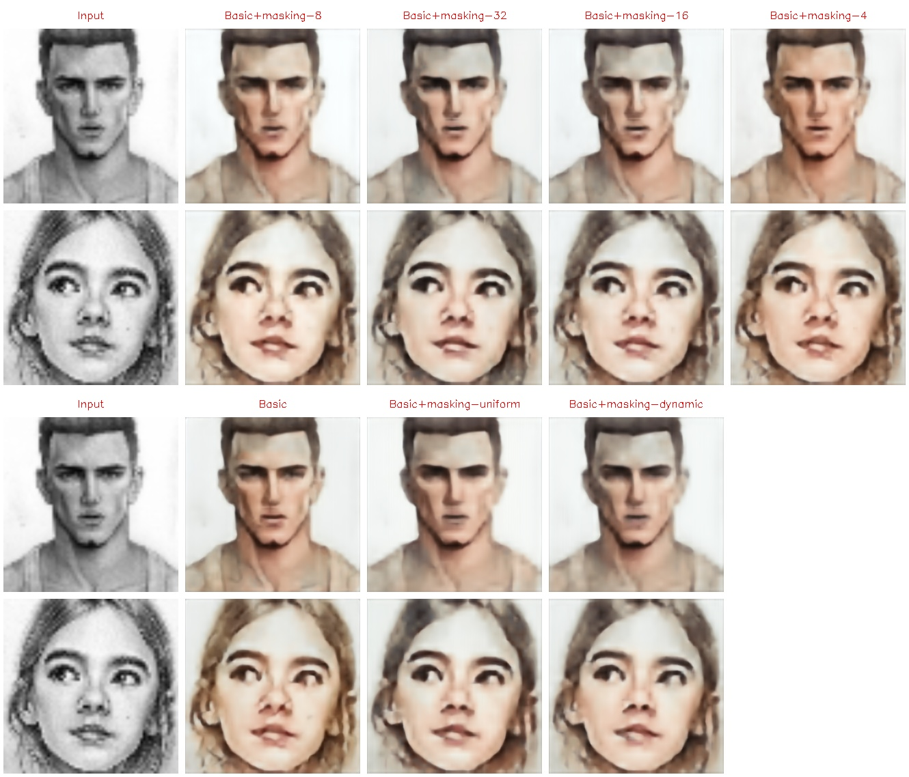
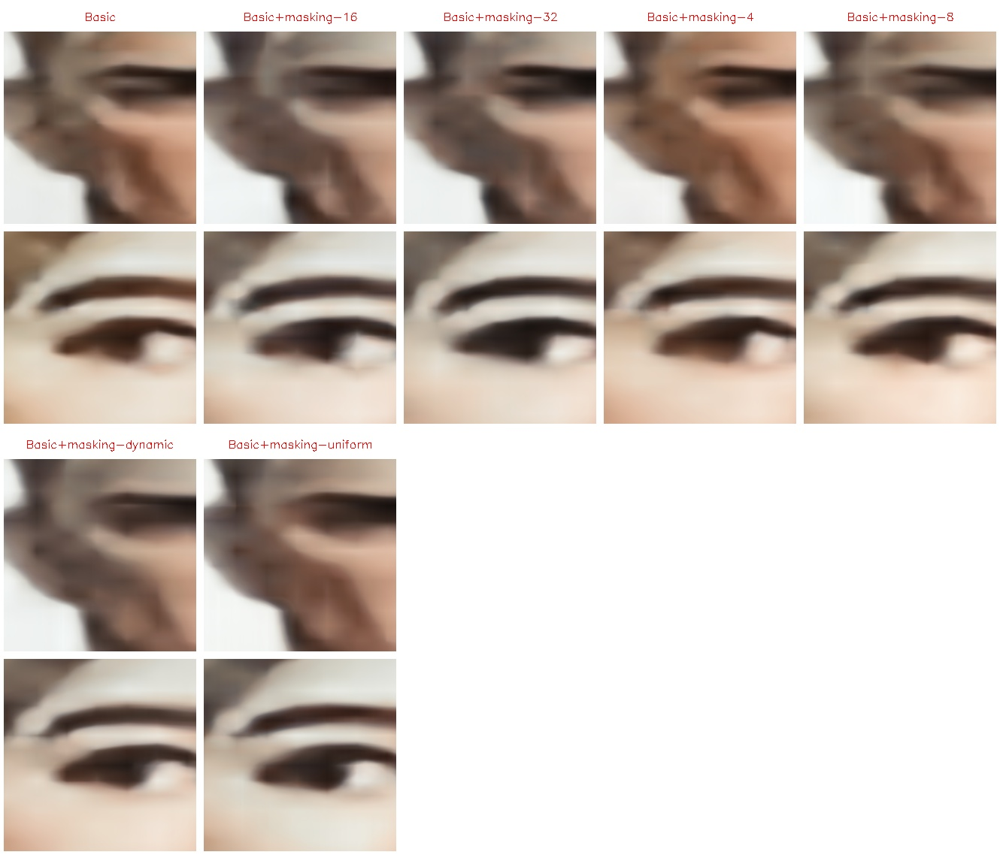

# Single-pass restorator visualization

Visualizations were created for the following models in decreasing order of loss:

- Basic+masking-dynamic (loss: 0.00691)
- Basic+masking-uniform (loss: 0.00671)
- Basic (loss: 0.00671)
- Basic+masking-4 (loss: 0.00651)
- Basic+masking-16 (loss: 0.00646)
- Basic+masking-32 (loss: 0.00639)
- Basic+masking-8 (loss: 0.00638)

As a reminder, as stated in the [README.md](../README.md), the baseline loss is set at `0.01100`. All models have successfully surpassed the baseline and have been able to restore a portion of the original image's color while simultaneously upscaling it from 64x64 to 178x178 pixels.

Visualizations were generated for the following images:

(Full size images can be found in the [img/testing](img/testing) folder.)

These images are clearly out-of-distribution but maintain the same semantic meaning as the training data. Additionally, it is important for the images to contain textures; otherwise, models may struggle to reconstruct colors accurately. Each image is initially downscaled to 64x64 and converted to grayscale. Then, a grid of points of the desired size (1024x1024 in this case, which is 16 times larger than the input image) is generated. The model predicts colors for each point independently, without considering the context of other points. This means that the model cannot take into account the image's overall context. The resulting colors of the points are assembled into an image of the desired size.

For ease of viewing, the images have been reduced to 256x256 to save space. This does not significantly distort the results and allows for a clear comparison between the models.

## Restoration of the entire image

It is interesting to note that models trained on larger masked areas, such as a 4x4 or 8x8 masking grid (which corresponds to a masking area size of 16x16 pixels and 8x8 pixels, respectively), tend to better preserve textures. This could potentially be utilized in the future to enhance the results.

## Restoration of a local region of the image

FrankNet operates with individual points, so it doesn't matter which points we choose for reconstruction. For simplicity, a method has been implemented to obtain not only the complete image but also an arbitrary rectangular region.

Below are examples of reconstructing a local region with coordinates `(0.2, 0.2) - (0.4, 0.6)` to a size of `1024x1024`:

The results are not particularly impressive, but the ability to reconstruct a local region is an interesting feature. With more accurate models, the results would be much better.